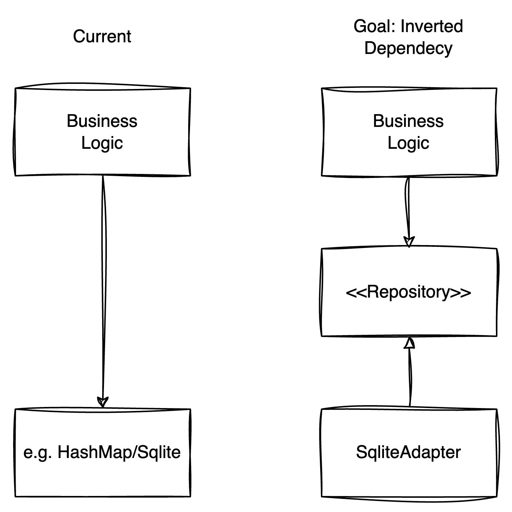

# (Optional) Dependency Injection/Inversion with Axum

As of now we added our state directly into our web project. For greater projects
it usually makes sense to abstract details away. In the end it should not matter,
how your state is stored. It might be an SQL like database, a file, or something else.

In the end you are only interested in "storing" your state. But how - is a matter of detail,
that we are now going to abstract away.

Currently, we have this dependency tree (left) - but we want to invert the dependency (right):



Here you do not have to code anything - we just wanted you to show, how a production style
rust webserver could look like. The code for it is in `snippets/injection`. You can run the unit tests with
`cargo test`, or run the webserver by `cargo run`.

## Turning around dependencies

Our goal would be to turn around the dependency, such that our business logic
does not depend on the implementation of the storage. Rather it should depend on an interface.
The implementation then should depend on that same interface as well.
This way, we can decouple
our business logic from the implementation of our storage.

In Rust you usually achieve this behaviour with Traits.

First we define our trait, that's our interface layer between the storage implementation and anything else (e.g. our business logic):

```rust
#[async_trait]
pub trait Repository {
    async fn add_user(&mut self, user: &UserToCreate) -> User;
    async fn remove_user(&mut self, id: i64) -> Option<User>;
    async fn get_users(&self) -> Vec<User>;
}
```

Next, we can then implement a struct, that wraps our details and implements the above trait.
We implement an `SqliteAdapter` - wrapping an `SqlitePool` and implementing above interface.

```rust
#[derive(Clone)]
pub struct SqliteAdapter {
    pool: SqlitePool,
}
```

```rust
#[async_trait]
impl Repository for SqliteAdapter {
    async fn add_user(&mut self, user: &UserToCreate) -> User {..}
    async fn remove_user(&mut self, id: i64) -> Option<User> {..}
    async fn get_users(&self) -> Vec<User> {..}
}
```

## How do you now use this trait in axum handlers?

To make use of our new trait, we have to make them known to our handlers (where we
usually have our business logic). Instead of using a struct inside our `State` extractor, we can
use the trait with static dispatch (generics):

```rust
pub async fn get_users<T: Repository>(State(repo): State<T>) -> impl IntoResponse {
    Json(repo.get_users().await)
}
```

Now our inner logic (turning things into a Json), does not depend on the implementation, but rather on the interface,
that promises to return a list of users.

As axum heavily depends on generics, it's a bit harder to tell the compiler, that we want to make
use of this trait. Structs, that implement our trait, also must implement more traits
to be used in a "generic" router.

To be correct they must implement: `Clone + Send + Sync + 'static`. For example our
`Arc<Mutex<HashMap<_,_>>>` would implement all of these above. For our SqliteAdapter
`Send + Sync` is implement be the wrapped `SqlitePool`. This is why have to declare our
`SqliteAdapter` to by `Clone`. Our structures are automatically `'static`, as we will create
them in the beginning of our program (see chapters below) - and we guarantee, they outlive all places where they are used.

TL;DR: Our router (that defines the routes, and uses our handlers) needs more guarantees to be generic
We have to make more guarantees, so we can use the interface we defined. A generic router looks like this now:

```rust
pub fn routes<T: Repository + Clone + Send + Sync + 'static>() -> Router<T> {
    Router::new()
        .route("/users", get(get_users::<T>).post(add_user::<T>))
        .route("/users/:id", delete(remove_user::<T>))
}
```

## How (and where) do you dependency inject the implementation?

After we have a trait layer between our storage implemention, the next question is,
where do we now _inject_ our `SqliteAdapter` into our program?

The answer is rather simple. We just give our `with_state(...)` method in the router builder
our `SqliteAdapter`. The compiler is happy, as `SqliteAdapter` meets all guarantees, we promised
our compiler.

We inject like this:

```rust
let pool = Sqlitepool:new()...;// create an sqlitepool from sqlx
let adapter = SqliteAdapter::new(pool).await;
let router = Router::new().merge(user::routes()).with_state(adapter);
```
